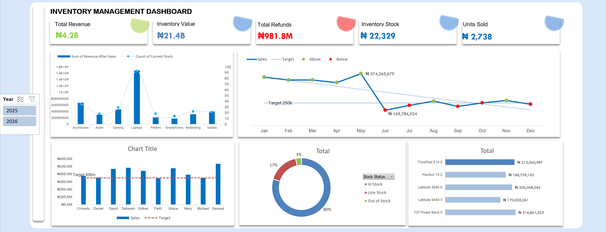

# 📦 Inventory Management Dashboard

## 📖 Overview

The *Inventory Management Dashboard* is an interactive Excel dashboard designed to provide real-time insights into inventory performance, sales trends, employee performance, and stock availability. It enables businesses to monitor key inventory metrics, identify top-performing products, compare monthly sales against targets, and make informed inventory decisions.

The dashboard uses Pivot Tables, Pivot Charts, Slicers, Conditional Formatting, and Excel formulas to transform raw inventory data into meaningful business insights.

---

## 🎯 Objectives

- Monitor overall inventory performance.
- Track revenue and inventory value.
- Compare monthly sales with business targets.
- Identify top-selling products.
- Monitor stock availability.
- Evaluate employee sales performance.
- Support inventory planning and business decision-making.

---

## 📊 Dashboard Features

### Key Performance Indicators (KPIs)

The dashboard highlights the following business metrics:

- 💰 *Total Revenue:* ₦4.2 Billion
- 📦 *Inventory Value:* ₦21.4 Billion
- 💸 *Total Refunds:* ₦981.8 Million
- 🏷️ *Current Inventory Stock:* 22,329 Units
- 🛒 *Units Sold:* 2,738

---

## 📈 Visualizations

### Revenue and Current Stock by Product Category

Compares revenue generated by each product category alongside current stock levels to identify products generating high revenue while monitoring remaining inventory.

Categories include:

- Accessories
- Audio
- Gaming
- Laptops
- Printers
- Smartphones
- Networking
- Tablets

---

### Monthly Sales Against Target

Tracks monthly sales performance against a predefined sales target.

This chart helps identify:

- Months exceeding target
- Months below target
- Overall sales trend throughout the year

---

### Yearly Sales Achievement by Employee

Measures each employee's yearly sales against the organizational sales target.

This visualization helps identify:

- Top-performing employees
- Employees below target
- Overall sales contribution

---

### Stock Availability Distribution

Displays inventory status as a percentage of:

- ✅ In Stock
- ⚠️ Low Stock
- ❌ Out of Stock

This helps inventory managers prioritize restocking decisions.

---

### Top Performing Products

Ranks products based on total revenue generated.

Example products include:

- ThinkPad E14 Gen 5
- Pavilion 15
- Latitude 5440
- Latitude 5440 3
- 737 Power Bank

---

## 🎛️ Interactive Features

The dashboard includes:

- Year Slicer (2025 & 2026)
- Dynamic Pivot Charts
- Interactive filtering
- Automated KPI updates
- Responsive dashboard layout

Users can quickly switch between years to analyze changes in sales and inventory performance.

---

## 💼 Business Insights

Using this dashboard, businesses can:

- Identify the highest revenue-generating product categories.
- Monitor inventory levels to reduce stock shortages.
- Track sales performance against targets.
- Recognize top-performing employees.
- Understand refund trends.
- Prioritize inventory replenishment.
- Make data-driven inventory decisions.

---

## 🛠️ Tools Used

- Microsoft Excel
- Pivot Tables
- Pivot Charts
- Slicers
- Conditional Formatting
- Excel Formulas
- Data Validation
- Dashboard Design

---

## 🚀 Future Improvements

Potential enhancements include:

- Supplier performance analysis
- Inventory turnover ratio
- Product profit margin analysis
- Branch-level inventory comparison
- Forecasting future inventory demand using Excel Forecast Sheet or Power BI
- Automated inventory alerts for low-stock products

---

## 📷 Dashboard Preview

> Replace the image path below with your uploaded dashboard screenshot.

markdown

