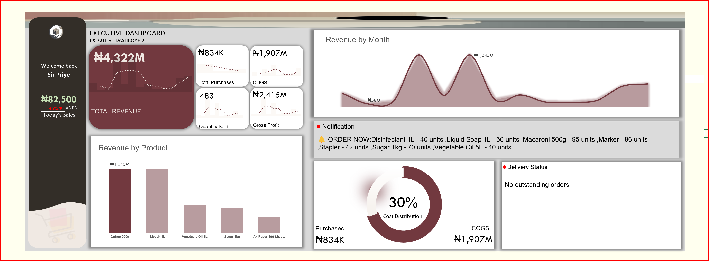
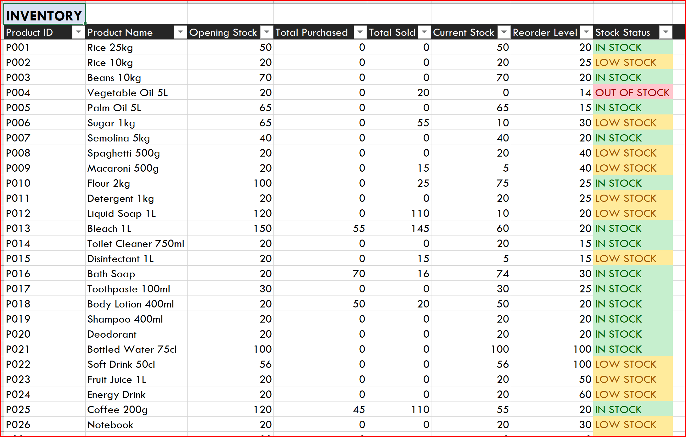
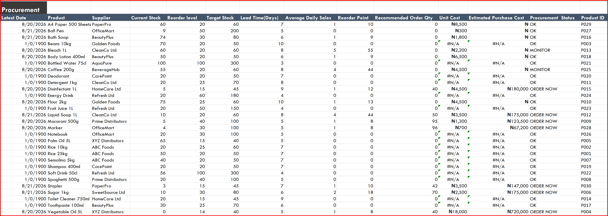
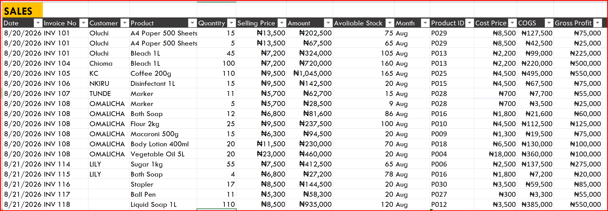
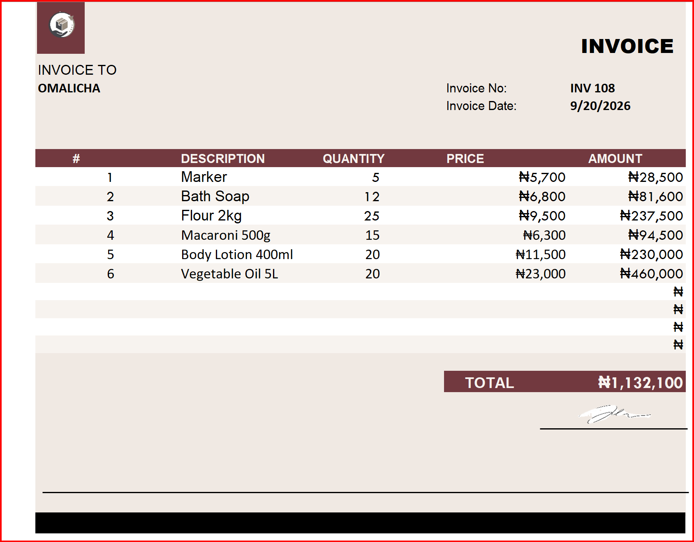

# Inventory & Procurement Management System

## 📌 Overview

This project is an *Excel-based Inventory and Procurement Management System* designed for a procurement/trading business that purchases products from suppliers and sells them to customers.

The system integrates *sales, inventory, procurement, supplier pricing, and delivery tracking* to help the business make informed operational decisions.

## 🎯 Business Problem

The business needed a way to:

- Monitor inventory levels
- Identify products that need to be reordered
- Determine recommended order quantities
- Track purchase orders and deliveries
- Monitor supplier price changes
- Evaluate supplier delivery performance
- Identify overstocked and understocked products
- Identify products with low or no recent sales

## 💡 Project Objective

The objective was to build a system that moves beyond simply recording transactions and instead uses operational data to answer:

> *What should we buy, when should we buy it, and how can we manage our suppliers effectively?*

## 🔄 Business Process

*Sales → Inventory → Reorder → Procurement → Supplier Delivery → Inventory Update*

---

## 📊 Dashboard

The Excel dashboard provides a centralized view of the business's inventory and procurement activities.

### Dashboard Highlights

- Daily Sales Tracker
- Weekly Reports
- Products requiring reorder
- Procurement recommendations
- Estimated procurement cost
- Pending deliveries
- Delayed orders
- Inventory and procurement notifications

### Dashboard Preview



> *Dashboard screenshot placeholder:* Replace images/dashboard.png with the path to your actual dashboard screenshot.

---

## 📸 Project Screenshots

### Inventory Management



### Procurement Analysis




### Sales Analysis



### Invoice



---

## 📊 Key Analysis

### Inventory Analysis

The system monitors:

- Current stock
- Target stock
- Reorder point
- Overstocked products
- Understocked products
- Out-of-stock products
- Products not sold recently

### Procurement Analysis

The system identifies:

- Products requiring reorder
- Recommended order quantities
- Estimated procurement cost
- Pending purchase orders
- Outstanding deliveries

### Supplier Analysis

Supplier performance is analyzed using:

- Supplier pricing
- Price changes
- Percentage price changes
- Price-change frequency
- Expected delivery dates
- Actual delivery dates
- Delivery delays
- Early and on-time deliveries

### Sales & Demand Analysis

Historical sales data is used to analyze:

- Product demand
- Quantity sold
- Sales revenue
- Best-selling products
- Recent sales activity
- Average daily sales

---

## 🧮 Inventory Logic

The inventory position is calculated using:

```text
Current Stock = Opening Stock + Received Purchases - Quantity Sold
