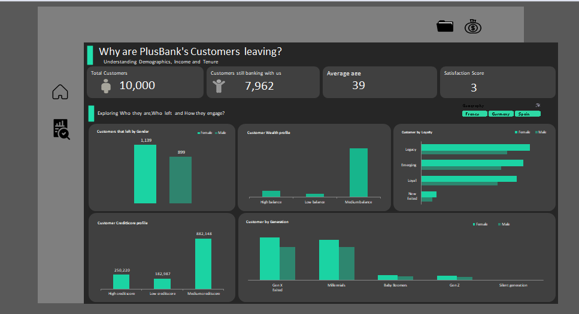

# Plus Bank Churn Analysis

## Overview
This repository contains a detailed churn analysis for *Plus Bank, based on a dataset of **1,000 customers* across *France, Germany, and Spain*.  
The goal of this project is to understand the characteristics of customers who left the bank and identify patterns that can help improve customer retention.

All analysis, calculations, and visualizations were completed *using Microsoft Excel only*.

---

## Dataset Summary
- *Total customers analyzed:* 1,000  
- *Customers currently with Plus Bank (bank-wide):* 7,962  
- *Average customer age:* 39 years  
- *Countries represented:* France, Germany, Spain  

---

## Key Findings

### 1. Demographic Insights
- A large proportion of customers who churned were *female*.
- Many belonged to the *Gen X age group* (approximately ages 40–55).
- This suggests that middle-aged female customers may be at higher churn risk.

---

### 2. Account & Financial Characteristics
- Most churned customers had their accounts for *8 to 10 years*.  
  Long-term customers leaving may signal a *decline in satisfaction over time*.
- They typically maintained *medium account balances*.
- Their *credit scores were generally average or okay*, so creditworthiness was not a primary churn factor.

---

### 3. Product & Engagement Insights
- Many churned customers owned *more than 2 products*, meaning cross-selling did not prevent churn.
- A high number owned *credit cards*.
- The majority of churned customers were *inactive members, indicating **low engagement* was a major churn driver.
- Churned customers recorded *higher complaint counts*, pointing to customer dissatisfaction and unresolved issues.

---

## Visualizations (Excel)

The following visualizations were created using Excel to support the analysis:

1. *Churn Distribution by Gender*  
   A bar chart showing that more females churned than males.

2. *Churn by Age Group*  
   A column chart highlighting that Gen X customers had the highest churn rate.

3. *Churn by Account Tenure*  
   A line or bar chart showing increased churn among customers with 8–10 years of account history.

4. *Churn by Number of Products Owned*  
   A bar chart demonstrating that customers with more than 2 products were more likely to churn.

5. *Customer Activity Status vs Churn*  
   A clustered bar chart showing churn was much higher among inactive members.

6. *Complaints vs Churn Status*  
   A comparison chart showing higher complaints among churned customers.

All charts were created directly in Excel using pivot tables and pivot charts.

---

## Summary of Insights
The analysis shows that churn at Plus Bank is strongly associated with:
- Female and Gen X customers  
- Long-standing customers (8–10 years)  
- Medium account balances  
- Customers owning multiple products  
- Credit card holders  
- Inactive members  
- Higher levels of complaints

These findings suggest that Plus Bank could reduce churn by:
- Improving customer engagement  
- Responding faster to customer complaints  
- Monitoring inactivity and reaching out proactively  
- Creating tailored retention plans for long-term customers  

---

## Tools Used
- *Microsoft Excel*  
  - Data cleaning  
  - Pivot tables  
  - Descriptive analysis  
  - Pivot charts and visualizations  

---

## Dashboards

