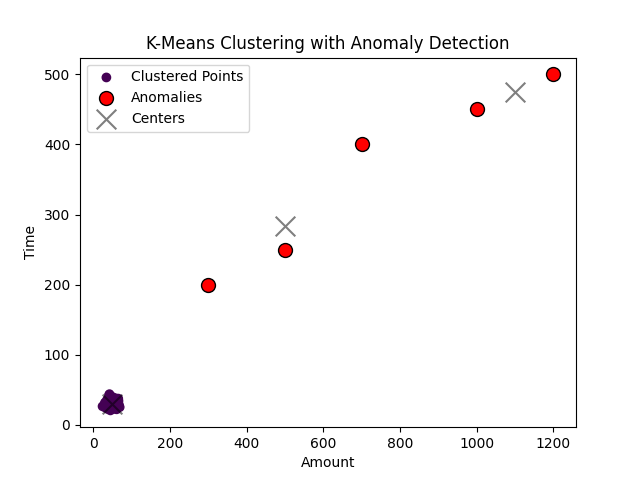

# Anomaly Detection in Transactions (Python)

## Project Overview
This project performs anomaly detection on transaction data using unsupervised learning techniques. The goal is to identify unusual transactions that deviate significantly from normal patterns based on transaction amount and time.

## Objectives
- Cluster transactions using k-means clustering based on transaction amount and time  
- Calculate a decision threshold to identify anomalous transactions  
- Detect and report anomalies that could indicate fraudulent or unusual activity

## Dataset Description
The dataset includes transaction records with the following features:  
- *Amount:* The monetary value of the transaction  
- *Time:* The time at which the transaction occurred
- *Transaction ID:* Unique ID of the transaction
- *Name:* Name of the customers

## Tools and Packages Used
- Python  
- Libraries: pandas, numpy, matplotlib.pyplot, scikit-learn (for k-means clustering)

## Methodology
1. *Data Preparation:* Loaded and preprocessed transaction data using pandas and numpy.  
2. *Clustering:* Applied k-means clustering with 3 clusters to group similar transactions.  
3. *Distance Calculation:* Calculated the Euclidean distance of each transaction to its respective cluster center.  
4. *Decision Threshold:* Used np.percentile to set a threshold at the 95th percentile of distances (threshold = 25.917).  
5. *Anomaly Detection:* Flagged transactions with distance above the threshold as anomalies.  

## Key Findings
- The model detected *5 anomalous transactions* based on the distance threshold.  
- These anomalies represent transactions that deviate significantly in amount and/or time compared to typical transaction clusters.

## Visualizations
- Scatter plot of clusters showing normal transactions and anomalies highlighted  
- Distribution of distances to cluster centers with threshold marked  
  
  

## Project Overview
This project performs anomaly detection on transaction data using unsupervised learning techniques. The goal is to identify unusual transactions that deviate significantly from normal patterns based on transaction amount and time.

## Objectives
- Cluster transactions using k-means clustering based on transaction amount and time  
- Calculate a decision threshold to identify anomalous transactions  
- Detect and report anomalies that could indicate fraudulent or unusual activity

## Dataset Description
The dataset includes transaction records with the following features:  
- *Amount:* The monetary value of the transaction  
- *Time:* The time at which the transaction occurred

## Tools and Packages Used
- Python  
- Libraries: pandas, numpy, matplotlib.pyplot, scikit-learn (for k-means clustering)

## Methodology
1. *Data Preparation:* Loaded and preprocessed transaction data using pandas and numpy.  
2. *Clustering:* Applied k-means clustering with 3 clusters to group similar transactions.  
3. *Distance Calculation:* Calculated the Euclidean distance of each transaction to its respective cluster center.  
4. *Decision Threshold:* Used np.percentile to set a threshold at the 95th percentile of distances (threshold = 25.917).  
5. *Anomaly Detection:* Flagged transactions with distance above the threshold as anomalies.  

## Key Findings
- The model detected *5 anomalous transactions* based on the distance threshold.  
- These anomalies represent transactions that deviate significantly in amount and/or time compared to typical transaction clusters.

## Visualizations
- Scatter plot of clusters showing normal transactions and anomalies highlighted  
- Distribution of distances to cluster centers with threshold marked  

## Recommendations
- Use this anomaly detection approach as an initial fraud detection tool.  
- Combine with other features (e.g., location, merchant type) for more robust detection.  
- Regularly update clustering model with new data to adapt to changing transaction patterns.  
- Investigate flagged anomalies promptly for potential fraud or errors.

---

## Recommendations
- Use this anomaly detection approach as an initial fraud detection tool.  
- Combine with other features (e.g., location, merchant type) for more robust detection.  
- Regularly update clustering model with new data to adapt to changing transaction patterns.  
- Investigate flagged anomalies promptly for potential fraud or errors.

## Conclusion
This clustering-based anomaly detection method effectively identifies unusual transactions and provides a useful starting point for fraud detection and risk management.

---
